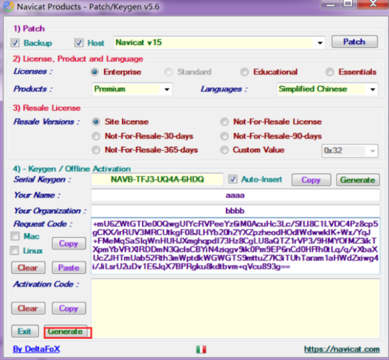

# Navicat Premium

> Navicat Premium 是一套数据库开发工具，让你从单一应用程序中同时连接 MySQL、MariaDB、MongoDB、SQL Server、Oracle、PostgreSQL 和 SQLite 数据库。它与 Amazon RDS、Amazon Aurora、Amazon Redshift、Microsoft Azure、Oracle Cloud、MongoDB Atlas、阿里云、腾讯云和华为云等云数据库兼容。你可以快速轻松地创建、管理和维护数据库。

[Navicat](https://www.navicat.com.cn/products/navicat-premium/)  
[Navicat download](https://www.navicat.com.cn/download/navicat-premium)

> 安装包及注册机均在压缩包内

## 破解教程

在激活工具的第一个选项(1.Patch)里选择Backup，Host，Navicat 是那个版本就选那个版本，这里就选择Navicat V 15 就好了，然后点击，Patch按钮，选择Navicat的安装位置中的navicat.exe文件

如下成功

选择对应的版本和语言，输入Your Name和Your Organization（可随意输入，也可以不修改使用默认的）,点击生成注册码，然后运行Navicat将注册码复制到软注册栏

点击激活，然后输入刚刚的激活码（此处部分人的激活码后面显示的是红叉，可能是由于上面步骤操作不规范；未显示cracked就启动了navicate、版本选择不匹配，Patch未选择等原因，可删除软件和安装目录后重新按照步骤安装）

选择手动激活

将生成的请求码复制到注册机中

点击Generate，生成的激活码会自动填充到Navicat（也可手动复制粘贴)

进入Navicat点击激活即可

## 参考

[Navicat Premium15安装与激活(完整激活版)](https://www.cnblogs.com/sq1995liu/p/12671331.html)
[https://www.jb51.net/article/199496.htm](https://www.jb51.net/article/199496.htm)
